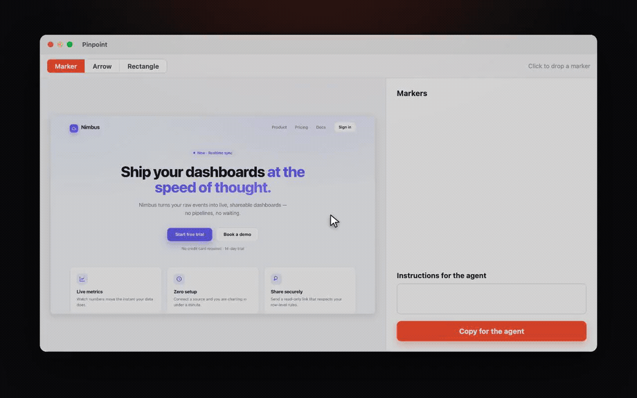

# Pinpoint

> Point at exactly what you mean.

Pinpoint is a native macOS menu-bar app that captures your screen, lets you drop
**numbered markers** on what matters, and copies a **ready-to-paste prompt** for
your AI agent — an annotated image plus instructions that reference every marker.

Built with Swift / SwiftUI + ScreenCaptureKit. Free & open source.

🔗 **[pinpoint-ashy.vercel.app](https://pinpoint-ashy.vercel.app)** · **[Download the latest release](https://github.com/croustibat/Pinpoint/releases/latest)**



## Download

1. Grab the latest **`Pinpoint.dmg`** from the [releases page](https://github.com/croustibat/Pinpoint/releases/latest).
2. Open it and drag **Pinpoint** into your Applications folder.
3. Launch it — it lives in your menu bar. Signed with a Developer ID and notarized by Apple.

On your first capture, macOS asks for **Screen Recording** permission
(System Settings → Privacy & Security → Screen Recording), then quit and
relaunch Pinpoint once.

**Requirements:** macOS 15 or later · Apple Silicon & Intel.

## Features

- **Region capture** — press **⌘⇧1** (rebindable) → the screen dims; drag a
  rectangle (live dimensions, `Esc` to cancel). Native resolution, multi-display
  and Retina aware. A "capture full screen" fallback lives in the menu.
- **Numbered markers** — click to drop ringed, numbered pins (drag to move, a
  note per marker). Add arrows and rectangles for emphasis.
- **Three marker styles** — filled disc, pointer pin, light outline — applied on
  screen *and* in the export.
- **A prompt your agent can read** — **⌘C** copies the annotated PNG **and** a
  structured text: image size, each marker's description and position (in %),
  then your instructions. Parses cleanly in Claude Code, Codex, and the like.
- **Legend baked in** (optional) — embeds the marker descriptions + instructions
  into the image, so a single paste carries everything (most chat UIs drop the
  clipboard text).
- **The shelf** — a built-in library of your screenshots: browse, favorite, sort,
  rename, Quick Look, and reopen any capture with its annotations.
- **Global shortcuts** — capture or open the shelf from anywhere, fully rebindable.
- **Bilingual** — follows your macOS language (English / French).
- **Native & private** — SwiftUI + ScreenCaptureKit, living in your menu bar.
  Your captures never leave your Mac.

## Build from source

The project uses [XcodeGen](https://github.com/yonaskolb/XcodeGen) to generate the
`.xcodeproj` (not versioned).

```bash
brew install xcodegen      # if needed
xcodegen generate          # creates Pinpoint.xcodeproj — run from the repo root
open Pinpoint.xcodeproj
```

In Xcode:

1. The signing **Team** is baked into `project.yml` (`DEVELOPMENT_TEAM`), so signing
   stays stable across `xcodegen generate` runs. On another machine, replace it with
   your own (System Settings → your developer account, or the OU of your *Apple
   Development* certificate).
2. **⌘R** to run.
3. On the first capture, grant **Screen Recording** (System Settings → Privacy &
   Security → Screen Recording), then relaunch the app.

To verify a build without any signing setup:

```bash
xcodegen generate && xcodebuild -scheme Pinpoint -destination 'platform=macOS' CODE_SIGNING_ALLOWED=NO build
```

> The fixed `DEVELOPMENT_TEAM` + stable bundle id (`app.croustibat.Pinpoint`) let
> macOS remember the screen-recording grant between builds. If a permission gets
> stuck after an identity change: `tccutil reset ScreenCapture app.croustibat.Pinpoint`,
> then relaunch and re-grant.

## Project structure

```
project.yml                       # XcodeGen config (deps, bundle id, LSUIElement, version…)
Pinpoint/
  PinpointApp.swift               # @main, Settings scene (Capture / Shelf tabs)
  AppDelegate.swift               # menu-bar status item + capture flow
  RegionSelectionController.swift # multi-display overlay + coordinate resolution
  RegionSelectionView.swift       # dimming + rectangle + live dimensions
  ScreenCapture.swift             # ScreenCaptureKit: region (sourceRect) or full screen
  CaptureRegion.swift             # model: target display + rect (points, top-left) + scale
  CaptureRecord.swift /
  CaptureHistory.swift            # recent captures (Application Support + JSON index)
  EditorView.swift                # annotation canvas + side panel
  EditorWindowController.swift    # AppKit window hosting the SwiftUI editor
  Pin.swift / Markup.swift        # marker + arrow/rectangle models
  PinStyle.swift                  # marker styles (disc / pointer / outline)
  Theme.swift                     # vermillon palette
  Exporter.swift                  # annotated PNG render + structured text + clipboard
  SettingsWindowController.swift  # AppKit settings window (works around the macOS 14+ SettingsLink bug)
  ShelfWindowController.swift     # the shelf window
  ScreenshotDetailWindowController.swift  # detail window for a shelf item
  Localizable.xcstrings           # String Catalog (English base, French)
  Shelf/                          # the screenshot library (Models, Services, Stores, Views)
landing/                          # the marketing site (Astro + Tailwind v4, bilingual)
```

## Dependencies

- [KeyboardShortcuts](https://github.com/sindresorhus/KeyboardShortcuts) (Sindre Sorhus) — rebindable global shortcuts.

## Release (notarized DMG)

The app icon is **generated** from the design system:

```bash
swift scripts/generate_icon.swift Pinpoint/Assets.xcassets/AppIcon.appiconset
```

A signed Developer ID build + notarization + DMG is produced by `scripts/release.sh`.
One-time setup — store the notarization credentials in a keychain profile:

```bash
xcrun notarytool store-credentials pinpoint-notary \
  --apple-id "<your-apple-id>" --team-id MMJD6CLKNQ \
  --password "<app-specific-password>"   # appleid.apple.com → Sign-In & Security → App-Specific Passwords
```

then:

```bash
scripts/release.sh   # → build/dist/Pinpoint.dmg (signed, notarized, stapled)
```

## License

[MIT](LICENSE) © 2026 Baptiste Bouillot
