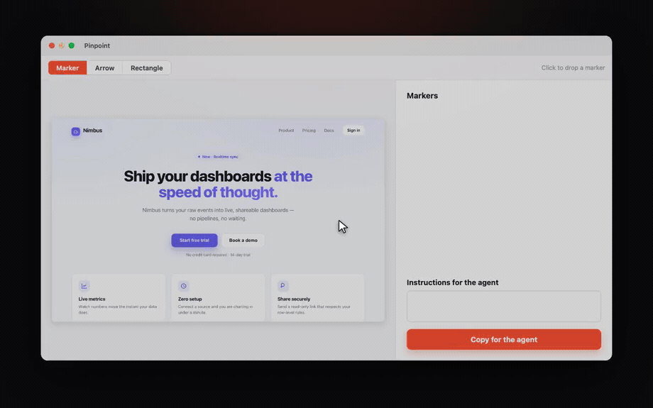

# Pinpoint

[](LICENSE)
[](https://github.com/croustibat/Pinpoint/releases/latest)
[](https://github.com/croustibat/Pinpoint/releases/latest)
[](https://developer.apple.com/swift/)

> Point at exactly what you mean.

Pinpoint is a native macOS menu-bar app that captures your screen, lets you drop
**numbered markers** on what matters, and copies a **ready-to-paste prompt** for
your AI agent — an annotated image plus instructions that reference every marker.

Built with Swift / SwiftUI + ScreenCaptureKit. Free & open source.

🔗 **[pinpoint-ashy.vercel.app](https://pinpoint-ashy.vercel.app)** · **[Download the latest release](https://github.com/croustibat/Pinpoint/releases/latest)**



## Why I built this

I pair-program with AI agents all day — Claude Code, Codex — and I kept hitting
the same wall: paste a screenshot, then type a paragraph to explain *which*
button or *which* misaligned icon I meant. Worse, most chat UIs keep only the
image and silently drop the text you copied with it, so half my context never
arrived.

Humans don't describe pixels to each other — we point. Pinpoint lets you do the
same with an agent: drop a numbered marker on the thing, and it copies an
annotated image **plus** a structured prompt that maps every marker to a
position and a note. No more "the button in the corner — no, the other one."

I built it for myself and use it every day. It's open source because the problem
isn't mine alone.

## Download

### Homebrew

```sh
brew install --cask croustibat/tap/pinpoint
```

On Homebrew 6+ you'll be asked to trust the tap once first — run
`brew trust croustibat/tap`, then re-run the install. See the
[tap](https://github.com/croustibat/homebrew-tap) for details.

The cask also puts the `pinpoint` command on your `PATH` — see
[Scripting](#scripting-the-pinpoint-cli).

### Direct download

1. Grab the latest **`Pinpoint.dmg`** from the [releases page](https://github.com/croustibat/Pinpoint/releases/latest).
2. Open it and drag **Pinpoint** into your Applications folder.
3. Launch it — it lives in your menu bar. Signed with a Developer ID and notarized by Apple.

On your first capture, macOS asks for **Screen Recording** permission
(System Settings → Privacy & Security → Screen Recording), then quit and
relaunch Pinpoint once.

**Requirements:** macOS 15 or later · Apple Silicon & Intel.

## Features

- **Region capture** — press **⌘⇧1** (rebindable) → the screen dims; drag a
  rectangle (live dimensions). It doesn't capture on release: resize it from
  its eight handles or nudge it with the arrow keys, then **Return** (or a
  click inside it) confirms, `Esc` cancels. Hold **Space** while selecting to
  switch to window mode instead — click any window and it's captured with its
  real edges. Native resolution, multi-display and Retina aware. A "capture
  full screen" fallback lives in the menu, and every capture checks the
  Screen Recording permission first, so a missing grant surfaces as a clear
  alert rather than a blank image.
- **Numbered markers & shapes** — click to drop ringed, numbered pins (drag to
  move, a note per marker); add arrows and rectangles for emphasis. Every
  shape is selectable, movable and resizable after the fact, with full
  **undo/redo** (**⌘Z** / **⇧⌘Z**) and keyboard delete.
- **Three marker styles** — filled disc, pointer pin, light outline — applied on
  screen *and* in the export.
- **Redact before you share** — **⌘4**, then drag over a token, password or API
  key: it's blacked out in the exported image, and stripped from the copied
  text *and* the accessibility context below, not just visually covered.
- **On-device OCR** — Vision reads the text sitting under each marker (an
  error message, a log line, a class name) with no network call, and can
  pre-fill a marker's note when nothing else already named the element.
- **Accessibility context** — while a region is captured, Pinpoint also reads
  the macOS accessibility tree. A marker that lands on a UI element carries
  its role, its label, its identifier, its exact frame, and the chain of
  containers around it — "marker 1 is the `AXButton` 'Login' inside Safari",
  not "marker 1 is at 62%, 48%". This is what turns a marker into something an
  agent can act on in your source rather than just look at. Optional: needs
  the **Accessibility** permission (see below); without it a marker still
  carries its pixel and percent position, just no interface detail.
- **A prompt your agent can read** — **⌘C** copies the annotated PNG **and** a
  structured text or JSON (your choice): image size, then per marker a stable
  ID, your note, its pixel and percent position, the accessibility element
  under it when there's one, and anything Pinpoint read there with OCR that
  your note didn't already say — followed by your instructions. Parses
  cleanly in Claude Code, Codex, and the like.
- **Task presets** — Bug, Review or Implement: pick one and a short paragraph
  of framing ("find the cause before proposing anything…") is written above
  your instructions, so the same scaffolding doesn't get retyped on every
  capture.
- **Legend baked in** (optional) — embeds the marker descriptions + instructions
  into the image, so a single paste carries everything (most chat UIs drop the
  clipboard text).
- **The shelf** — a built-in library of your screenshots: search, browse,
  favorite, sort, rename, Quick Look, and reopen any capture with its
  annotations (deleting one asks first).
- **Global shortcuts** — capture or open the shelf from anywhere, fully rebindable.
- **Scriptable** — a `pinpoint` CLI, a `pinpoint://` URL scheme, and an
  [MCP](https://modelcontextprotocol.io) server (`pinpoint mcp`) so agents,
  hooks and `!`-commands can ask for a capture and read the result directly —
  the file path and structured Markdown, never an inline image.
- **Bilingual** — follows your macOS language (English / French).
- **Native, private & accessible** — SwiftUI + ScreenCaptureKit, living in
  your menu bar. Captures, OCR and the accessibility read all happen on your
  Mac and never leave it. VoiceOver, Dynamic Type and reduce-motion are
  supported throughout the app itself.

### What to allow

| Permission | Required? | What it's for | Without it |
| --- | --- | --- | --- |
| **Screen Recording** | Yes | Taking a capture at all | Pinpoint can't take a screenshot — it checks before it tries and walks you to System Settings ▸ Privacy & Security ▸ Screen Recording rather than failing silently. |
| **Accessibility** | No, opt-in | The `UI:` / `Path:` lines under each marker | Everything else keeps working exactly the same — capture, markers, OCR, redaction. A marker just carries its pixel/percent position and nothing about the element under it. |

Neither is requested eagerly: Screen Recording is checked right before your
first capture, and Accessibility is never asked for until you turn it on
yourself from Pinpoint's Settings, which deep-links straight to the right
System Settings pane.

This is real output — produced by feeding fabricated markers into this repo's
own, unmodified `Exporter.buildText` (not hand-written), at the coordinates of
the staged bug that [the demo script](docs/demo-script.md) walks through
recording a capture against:

```text
# Annotated capture — 1280×800 px

An image is attached. Numbered (ringed) badges point to specific elements.
Positions are given in pixels from the top-left corner (0, 0), then as a percentage of the image size.

## Markers
M1, M2… are the numbers drawn on the image; the code in brackets is a stable ID for that marker.
“UI” lines name the interface element found under the marker in the macOS accessibility tree at capture time — its role, its label, the app owning it, and its box in this image. “Path” is the chain of containers around it.
“Text” lines are what Pinpoint read in the pixels under the marker, on this Mac. A marker’s description may have been pre-filled from such a read and then edited by the user.

- M1 [a074e5] · Doesn't stay full-width once the layout stacks on mobile — (794, 384) px · (62 %, 48 %)
  - UI: AXButton “Start free trial” · com.apple.Safari · box (740, 360) 170×56 px
  - Path: AXWindow “Nimbus — Demo for Pinpoint capture” › AXButton “Start free trial”
  - Text: “Start free trial”
- M2 [239cc7] · Logo mark sits a few pixels below the wordmark baseline — (90, 44) px · (7 %, 6 %)
  - UI: AXWindow “Nimbus — Demo for Pinpoint capture” · com.apple.Safari · box (0, 0) 1280×800 px
  - Path: AXWindow “Nimbus — Demo for Pinpoint capture”

## Task — Bug
The markers point at a defect. Find its cause before proposing anything: locate the code that produces what is marked, explain why it behaves this way, then propose the smallest change that addresses the cause rather than the symptom. If the capture isn’t enough to be sure, say what you would need to look at.

## Instructions
Make the CTA full-width on mobile and fix the icon alignment.
```

M2 resolves to nothing more specific than the window because the icon it sits
on is marked `aria-hidden` in that page's markup — nothing more specific was
under the pixel. That's the graceful-degradation path in the bullet above,
not a bug in this example: the marker still carries an exact position, and an
agent still has the image itself to look at.

## Build from source

The project uses [XcodeGen](https://github.com/yonaskolb/XcodeGen) to generate the
`.xcodeproj` (not versioned).

```bash
brew install xcodegen      # if needed
xcodegen generate          # creates Pinpoint.xcodeproj — run from the repo root
open Pinpoint.xcodeproj
```

In Xcode:

1. The signing **Team** is baked into `project.yml` (`DEVELOPMENT_TEAM`), so signing
   stays stable across `xcodegen generate` runs. On another machine, replace it with
   your own (System Settings → your developer account, or the OU of your *Apple
   Development* certificate).
2. **⌘R** to run.
3. On the first capture, grant **Screen Recording** (System Settings → Privacy &
   Security → Screen Recording), then relaunch the app.

To verify a build without any signing setup:

```bash
xcodegen generate && xcodebuild -scheme Pinpoint -destination 'platform=macOS' CODE_SIGNING_ALLOWED=NO build
```

> The fixed `DEVELOPMENT_TEAM` + stable bundle id (`app.croustibat.Pinpoint`) let
> macOS remember the screen-recording grant between builds. If a permission gets
> stuck after an identity change: `tccutil reset ScreenCapture app.croustibat.Pinpoint`,
> then relaunch and re-grant.

## Project structure

```
project.yml                       # XcodeGen config (deps, bundle id, LSUIElement, version…)
Pinpoint/
  PinpointApp.swift               # @main, Settings scene (Capture / Shelf tabs)
  AppDelegate.swift               # menu-bar status item + capture flow
  RegionSelectionController.swift # multi-display overlay + coordinate resolution
  RegionSelectionView.swift       # dimming + rectangle + live dimensions
  ScreenCapture.swift             # ScreenCaptureKit: region (sourceRect) or full screen
  CaptureRegion.swift             # model: target display + rect (points, top-left) + scale
  CaptureRecord.swift /
  CaptureHistory.swift            # recent captures (Application Support + JSON index)
  EditorView.swift                # annotation canvas + side panel
  EditorWindowController.swift    # AppKit window hosting the SwiftUI editor
  Pin.swift / Markup.swift        # marker + arrow/rectangle/redaction models
  PinStyle.swift                  # marker styles (disc / pointer / outline)
  TaskPreset.swift                # Bug / Review / Implement framing (#53)
  EditorHistory.swift             # undo/redo stack for the annotation model (#44)
  Redaction.swift                 # what a hidden region strips from the export (#50)
  TextRecognizer.swift            # on-device OCR under each marker, Vision (#49)
  AXSnapshot.swift                # a frozen slice of the macOS accessibility tree (#55)
  AXSnapshotCollector.swift       # walks that tree at capture time
  AXPermission.swift              # the (optional) Accessibility permission grant
  Theme.swift                     # vermillon palette
  Exporter.swift                  # annotated PNG render + structured text + clipboard
  FileHandoff.swift               # writes capture.{png,md,json} where an agent can read them
  HandoffContract.swift           # where those files live + how to read one back (shared with the CLI)
  HandoffDocument.swift           # the JSON contract for capture.json (schemaVersion 1)
  HandoffDocumentBuilder.swift    # fills that contract in from the annotation model
  AgentTextFormat.swift           # Markdown vs JSON on the clipboard (#52)
  URLCommand.swift                # pinpoint:// deep links — what is accepted, and what isn't
  SettingsWindowController.swift  # AppKit settings window (works around the macOS 14+ SettingsLink bug)
  ShelfWindowController.swift     # the shelf window
  ScreenshotDetailWindowController.swift  # detail window for a shelf item
  Localizable.xcstrings           # String Catalog (English base, French)
  Shelf/                          # the screenshot library (Models, Services, Stores, Views)
PinpointCLI/                      # the `pinpoint` tool, embedded in the app at Contents/Helpers
  MCP/                             # `pinpoint mcp` — the stdio server (JSONRPC, MCPTransport,
                                    # MCPTools, MCPServer); reads the same HandoffContract
landing/                          # the marketing site (Astro + Tailwind v4, bilingual)
```

## Agent handoff (files on disk)

Copying from the editor doesn't only fill the clipboard: it also writes the
capture to a fixed path, because a clipboard image is not something every agent
can read (Claude Code doesn't render images returned inline by an MCP server —
[anthropics/claude-code#31208](https://github.com/anthropics/claude-code/issues/31208)).
A file path is the channel that reliably works.

```
~/Library/Application Support/Pinpoint/last/capture.png    annotated image, native resolution, no legend strip
~/Library/Application Support/Pinpoint/last/capture.md     the agent-ready text (markers, shapes, instructions)
~/Library/Application Support/Pinpoint/last/capture.json   the same facts, machine-readable — see HandoffDocument.swift
~/Library/Application Support/Pinpoint/archive/<stamp>/    a timestamped copy of each handoff
```

- The path is fixed on purpose: an agent has to be able to hard-code it rather
  than discover it. Point one at `capture.md` and it has everything.
- The triplet is staged in a sibling folder and swapped in atomically, so a
  reader gets the previous handoff or the new one, never a mix of the two.
- `capture.md` always carries the complete text, whatever the "legend in the
  image" setting says — unlike the clipboard, which drops it when the legend is
  baked into the PNG.
- Pixel coordinates in `.md`/`.json` are in the grid of `capture.png` itself, so
  on a Retina capture they read 2× the size in points.
- **The archive keeps the 10 most recent handoffs**, oldest deleted first. Each
  folder holds a full-resolution PNG, so the cap is deliberately low.
- `capture.json` carries a `schemaVersion`. New keys can appear without bumping
  it — consumers must ignore what they don't know. The full contract is
  published as a JSON Schema at
  [`docs/capture-schema.json`](docs/capture-schema.json).

## Scripting: the `pinpoint` CLI

Pinpoint ships a small command-line tool **inside the app bundle**, at
`Pinpoint.app/Contents/Helpers/pinpoint`, so it is signed and notarized with the
app. The Homebrew cask symlinks it onto your `PATH`; after a direct download,
link it yourself:

```sh
ln -s "/Applications/Pinpoint.app/Contents/Helpers/pinpoint" /usr/local/bin/pinpoint
```

```sh
pinpoint capture --out ./bug.png --json   # ask the app for a capture, wait for the copy
pinpoint last --json                      # the most recent handoff, machine-readable
pinpoint last --format md                 # the agent-ready text, verbatim
pinpoint --help
```

Two commands, split by what they need rather than by what they do:

| command | needs | does |
| --- | --- | --- |
| `pinpoint last` | nothing — reads files | prints the handoff already on disk |
| `pinpoint capture` | the running app | starts a region capture and waits for you to press Copy |

`capture` deliberately doesn't take the screenshot itself. macOS grants Screen
Recording to the app bundle you allowed by name, not to a bare executable, so the
tool asks the app through `pinpoint://` and waits for the handoff to land. The
region is always drawn by hand.

The output is built to be read by a program:

- `--json` puts **one** JSON document on stdout and nothing else — on success and
  on failure alike (`{"ok":false,"error":{"code":…}}`). Every human sentence goes
  to stderr.
- `capture.json` travels **verbatim** under the `capture` key rather than being
  re-encoded, so a newer app can add keys without an older CLI dropping them.
- Exit codes tell a state from an error: `0` done · `1` failed · `2` bad usage ·
  `3` no capture handed off yet · `4` timed out waiting for the copy · `5` Pinpoint
  isn't installed.

## MCP server: `pinpoint mcp`

The same binary also speaks [MCP](https://modelcontextprotocol.io) over stdio, so
an agent can ask for a capture itself instead of you pasting one in. It is **the
one MCP annotation server that works system-wide** rather than only inside a
browser DOM — Pinpoint captures whatever is on screen, any app, any window.

The whole design turns on one fact: **Claude Code doesn't render an image an MCP
tool returns inline** — the base64 lands in the transcript as raw text
([anthropics/claude-code#31208](https://github.com/anthropics/claude-code/issues/31208),
closed "not planned"). So `pinpoint mcp` never sends image bytes over the wire.
Every tool call returns the **absolute path of the annotated PNG plus the
structured Markdown** described above, and tells the agent outright to open the
PNG with its own file-reading tool. That's the file handoff this README already
describes — the MCP server is a thin JSON-RPC front door onto it, built on the
very same `HandoffContract` the CLI reads, so the three never disagree about
where a capture lives or what it contains.

Add it with the Claude Code CLI, pointing at the binary the app already ships:

```sh
claude mcp add pinpoint -- /Applications/Pinpoint.app/Contents/Helpers/pinpoint mcp
```

or, if you linked `pinpoint` onto your `PATH` as shown above:

```sh
claude mcp add pinpoint -- pinpoint mcp
```

Equivalently, the JSON entry in `.mcp.json` or your client's config:

```json
{
  "mcpServers": {
    "pinpoint": {
      "command": "/Applications/Pinpoint.app/Contents/Helpers/pinpoint",
      "args": ["mcp"]
    }
  }
}
```

Three tools:

| tool | needs | does |
| --- | --- | --- |
| `capture_region` | the running app | starts an interactive region capture and blocks until you press Copy — same as `pinpoint capture` |
| `get_last_capture` | nothing — reads files | returns the most recent handoff without prompting for a new screenshot |
| `list_recent` | nothing — reads files | lists up to the last 10 archived captures, newest first |

Every result carries the PNG's path, the same Markdown `capture.md` holds, and a
`structuredContent` object with `capture.json` verbatim — so an agent that would
rather index the facts than parse them back out of prose can. A capture that
timed out or a "nothing handed off yet" comes back as a normal tool result with
`isError: true`, not a protocol failure, so the agent can see what happened and
retry or ask instead of just failing silently.

`pinpoint mcp` writes **only** JSON-RPC to stdout — that's the stdio transport's
rule, and one stray log line breaks it for the whole session. Every human-facing
sentence, including the ones you'd see running `pinpoint capture` at a terminal,
goes to stderr instead.

## Deep links (`pinpoint://`)

| URL | what it does |
| --- | --- |
| `pinpoint://capture` | starts the interactive region capture (same as ⌘⇧1) |
| `pinpoint://last` | reopens the last handoff in the editor |
| `pinpoint://last?format=json` (or `md`, `png`) | reveals that file in the Finder |

Anything else is ignored, silently and on purpose.

A URL can come from anywhere — a shell script, a terminal, or a web page you
merely visited — and macOS doesn't say which. So the scheme is kept deliberately
narrow: each URL names one action and carries nothing else (no coordinates, no
destination path, nothing that could turn into a file write), `capture` only ever
opens the same overlay you have to drag on and an editor you have to press Copy
in, and nothing ever answers back — a page that fires one learns nothing about
your Mac, not even whether Pinpoint is installed. **No URL takes a screenshot on
its own**, which is why the menu's full-screen capture has no deep link.

## Dependencies

- [KeyboardShortcuts](https://github.com/sindresorhus/KeyboardShortcuts) (Sindre Sorhus) — rebindable global shortcuts.

## Release (notarized DMG)

The app icon is **generated** from the design system:

```bash
swift scripts/generate_icon.swift Pinpoint/Assets.xcassets/AppIcon.appiconset
```

A signed Developer ID build + notarization + DMG is produced by `scripts/release.sh`.
One-time setup — store the notarization credentials in a keychain profile:

```bash
xcrun notarytool store-credentials pinpoint-notary \
  --apple-id "<your-apple-id>" --team-id MMJD6CLKNQ \
  --password "<app-specific-password>"   # appleid.apple.com → Sign-In & Security → App-Specific Passwords
```

then:

```bash
scripts/release.sh   # → build/dist/Pinpoint.dmg (signed, notarized, stapled)
```

Then publish the release, bump the Homebrew cask, and update the Sparkle appcast:

```bash
git tag vX.Y.Z && git push origin vX.Y.Z
gh release create vX.Y.Z --latest build/dist/Pinpoint.dmg#Pinpoint.dmg
scripts/update-cask.sh      # → pushes the version + sha256 to croustibat/homebrew-tap
scripts/update-appcast.sh   # → signs the DMG (EdDSA) and adds it to landing/public/appcast.xml
```

> The cask lives in a separate repo (`croustibat/homebrew-tap`) and must carry a
> `binary` stanza, otherwise `brew install` leaves the CLI unreachable:
>
> ```ruby
> app "Pinpoint.app"
> binary "#{appdir}/Pinpoint.app/Contents/Helpers/pinpoint"
> ```
>
> `scripts/release.sh` signs that nested executable before signing the app —
> `codesign` refuses to sign a bundle containing unsigned nested code, and
> notarization refuses the archive after it.

Add the release to the changelog (`landing/src/changelog.ts` — new entry at the top,
mark it `latest`), then commit it together with `landing/public/appcast.xml` and redeploy
the landing (`vercel deploy --prod`) so in-app auto-update (Sparkle) sees the new version
and [`/changelog`](https://pinpoint-ashy.vercel.app/changelog) shows it. The EdDSA private
key lives in the release machine's keychain (paired with `SUPublicEDKey` in `project.yml`);
create it once with Sparkle's `generate_keys`.

## License

[MIT](LICENSE) © 2026 Baptiste Bouillot
